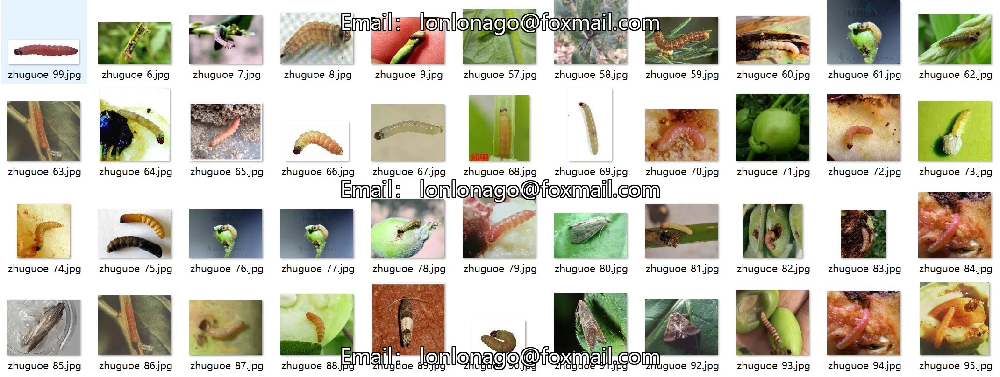
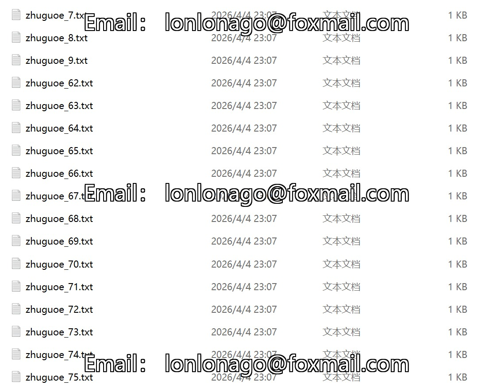
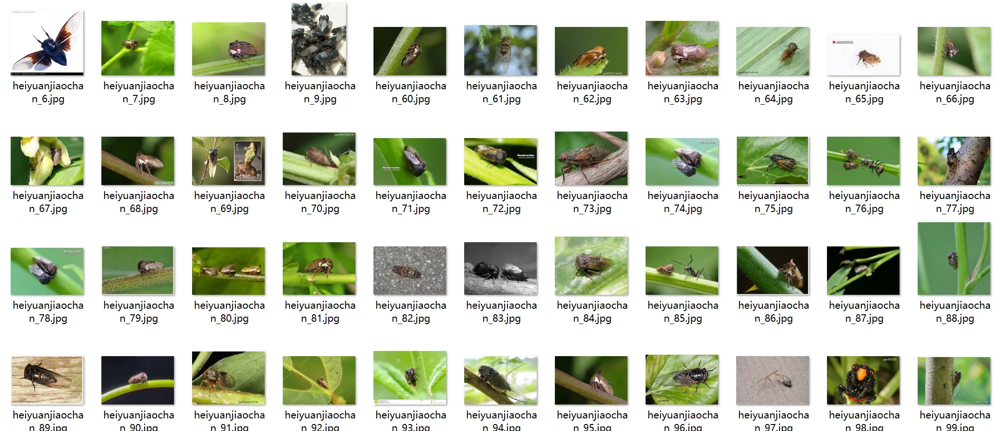

## Body

（Agricultural Product）Photos and Textual Multimodal Retrieval Dataset for Tomato Hornworm

This dataset consists of three parts: firstly, the augmented images, which include 17 data files, high-quality images of 17 common tomato hornworm pests such as locusts, large green leafhoppers, tomato nematodes, tomato black stink bugs, and black round bugs. Each JPG file is named with a serial number, totaling 9496 databases (sets) in all. Secondly, the enhanced textual data, which includes 17 TXT files, each named with a serial number that matches the corresponding image data, totaling 9496 pieces of text data. Thirdly, the raw images and textual data without any augmentation treatment, consisting of two data files, one containing 1900 images of the original data and the other containing 1900 pieces of English text data.

Accompanying the dataset are the original papers.

Project Funding: National Natural Science Foundation

Electronic virtual products sold are non-refundable.

## Images

Here is a pay link on Stripe ( https://buy.stripe.com/3cs8yP7sY87d0vu9AB ). Please contact me lonlonago@foxmail.com after funding $89, and I will send you a complete data files , thank you!

